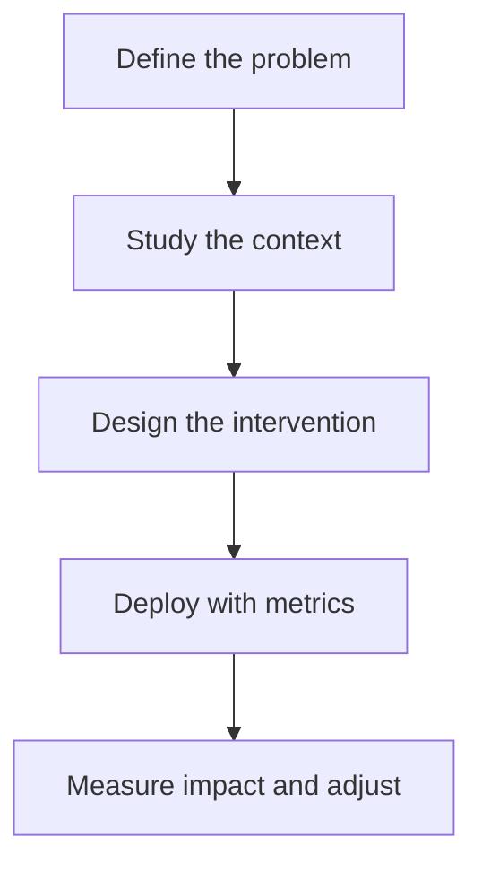

# Usable Security Heuristics and Behaviour Change

This chapter is an English adaptation of the ideas discussed in the original Russian article and its comment thread. It is intentionally rewritten for clarity and flow rather than translated line by line.

Security teams often start with awareness courses, policy reminders, and simulated phishing campaigns. Those tools matter, but they rarely change behaviour on their own. If a company wants employees to act more safely, it first has to understand what behaviour it expects, what stands in the way, and how much friction its controls add to everyday work.

The central idea is simple: security is a service function. It should reduce risk without making people fight the product, the process, or the policy at every step.

## Start With the Behaviour, Not the Control

Before introducing a control, define the behaviour you want in concrete terms. Vague goals such as "improve security culture" are weak. Better goals are specific, observable, and tied to real risk.

In practice, security goals should be:

- rooted in risk assessment;
- framed as concrete actions people can actually perform;
- short-term enough to evaluate;
- measured by outcomes, not slogans.

Risk usually becomes clearer when you examine at least three dimensions:

- severity: how damaging the outcome is;
- frequency: how often the risky behaviour occurs;
- criticality: how important the affected asset, workflow, or business function is.

Once those factors are visible, the conversation changes. Instead of asking, "How do we force everyone to comply?" you start asking, "What would make the safe action the easiest action?"

## Behaviour Change Is Not One-Size-Fits-All

Several models describe how people change behaviour. The transtheoretical model is one of the best known and moves from no intention to change, to reflection, preparation, action, maintenance, and finally a stable new habit. Other useful lenses include the Information-Motivation-Behavioural Skills model, the Behaviour Change Wheel, and COM-B.

None of them is universal. Every organisation has its own laws, constraints, incentives, habits, language, and unwritten rules. The point is not to pick a fashionable framework. The point is to understand why people behave the way they do in this environment.

People routinely trade security for convenience, speed, or social ease. A password policy may look strict and elegant on paper, yet still fail if it overloads memory, ignores accessibility needs, or interrupts work too often. In many cases, passphrases, password managers, and fast two-factor authentication create better security than theoretically stronger but painful rules.

## A Practical Model for Security Behaviour Work

My preferred workflow looks like this:

### 1. Define the problem

Identify the risky behaviour and the desired replacement. Observe what people do today before deciding what they should do tomorrow.

### 2. Study the context

Look at the environment around the behaviour: usability barriers, cultural norms, access rights, knowledge gaps, motivation, tools, and timing.

### 3. Design the intervention

The answer may be a technical control, but it may also be clearer documentation, a better default setting, a faster workflow, a champion network, or regular communication with staff.

### 4. Deploy with metrics

Interventions should be launched with an explicit measurement plan.

### 5. Measure impact and adjust

If the intervention increases friction without reducing risk, it is not finished. Rework it.

Along the way, teams usually create several kinds of artefacts:

- conceptual artefacts such as ideas and hypotheses;
- procedural artefacts such as methods and instructions;
- formal regulations and policies;
- empirical artefacts such as research observations;
- directive artefacts that explain how to achieve a result;
- facts and findings;
- stimuli or prompts intended to trigger behaviour.

## Security Governance Is About People, Processes, and Policy

Any security management model depends on three inputs:

- normative inputs such as laws, rules, and organisational values;
- business risks tied to strategy, brand, and reputation;
- operational risks created by everyday use, administration, and deployment of technology.

These inputs should be prioritised by stakeholders, then translated into processes and technologies. Operational risk is especially useful because it exposes where human-computer interaction goes wrong in everyday work. When people constantly bypass a control, that usually signals a design problem, a priority conflict, or both.

## Usable Security Heuristics

Usable security benefits from the same discipline as good product design. Heuristics are helpful because they offer ready-made evaluation lenses before a team jumps into expensive research or overengineered controls.

### Make security visible and understandable

- Users should always be able to access security-relevant information.
- The system should clearly indicate when a security state changes.
- Required security actions should be explicit, not implied.
- Interfaces should support different levels of detail for beginners and experienced users.
- Only the security information needed for the current task should be shown.
- Messages should be short, plain, and descriptive.
- The use of personal data should be explained clearly.
- Unsafe system states should be visible.
- Security terminology should be consistent, meaningful, and aligned with standards.
- If a security feature causes delay, the user should see progress and status.

Clarity builds trust. Confusing security language does the opposite.

### Reduce cognitive load in authentication

- Authentication should protect sensitive areas by default.
- Users should be able to choose from suitable authentication methods where appropriate.
- Authentication flows should avoid excessive mental effort.
- Password policy should be strong but easy to understand.
- Users should be able to change passwords without drama.
- Password rules should be shown when the password is being created.
- Passwords should remain hidden by default.
- Successful and failed authentication outcomes should be clearly communicated.
- Repeated failed attempts should trigger sensible protection.

The standard of success is not "technically possible." It is "secure without exhausting the user."

### Preserve user control

- Consent for terms, privacy policy, and third-party sharing should be explicit.
- Users should be able to choose how some security states are displayed.
- Frequent actions should have efficient shortcuts.
- Security preferences should be adjustable when the context allows it.
- User-initiated security operations should be reversible when possible.
- Destructive or irreversible security actions should require confirmation.
- People should be able to update or remove personal data.
- Secure-by-default and privacy-by-default principles should be real defaults, not marketing claims.

### Help people recover from mistakes

- Error messages should explain the cause.
- They should state severity.
- They should tell the user what to do next.
- They should be written in human language.

### Keep help close and make systems accessible

- Help and documentation should be available without stopping the task.
- Guidance should follow the user journey.
- Updates to documentation should be communicated.
- Assistance should be reachable from every screen where it matters.
- Authentication and access methods should support different needs, including low vision, reading difficulty, and other accessibility constraints.

These principles align well with classic Nielsen heuristics when adapted for cybersecurity: visibility of system status, match with the real world, user control, consistency, error prevention, recognition over recall, flexibility, minimalism, recovery support, and accessible documentation.

## Metrics: Measure What Matters in Context

Security metrics are only meaningful in a specific environment. Good metrics are quantitative, concrete, and tied to an actual behaviour, system property, or workflow.

Useful examples include:

- number of blocked connections or attacks;
- number of devices with outdated antivirus signatures;
- count of security-related support requests;
- phishing click rate;
- whether a user entered sensitive data after opening a phishing email;
- time between opening a malicious email and launching its attachment;
- number of automatic workstation locks triggered by inactivity.

A vague number such as "percentage reduction in cyber risk" is usually too abstract to guide product or policy decisions, even if a tool presents it confidently.

Sometimes direct observation helps, but observation alone is weak in cybersecurity. In large or distributed organisations it is expensive, intrusive, and easy to game. People change behaviour when they know they are being watched. A better approach is to combine observation, self-reporting, and technical telemetry where direct measurement is hard.

For mature teams, even infrastructure-heavy systems such as SIEM platforms can be assessed through detailed measurement. That may include:

- source data structure and the amount of synthetic data;
- message size and data generation method;
- platform size and hardware characteristics;
- normalisation, enrichment, and correlation rule coverage;
- average table size used in enrichment or correlation;
- number of rules that actually fired and generated incidents;
- storage strategy for raw and normalised events.

If that level of maturity is not realistic yet, a simple and durable framework still works well: effectiveness, efficiency, and satisfaction.

- Effectiveness asks whether people can successfully complete the secure action.
- Efficiency asks how much time and cognitive effort it takes.
- Satisfaction asks how the experience feels physically, cognitively, and emotionally.

Security controls that repeatedly irritate, confuse, or interrupt people may remain compliant on paper while failing in practice.

## What Deserves Extra Attention

Several design principles repeatedly improve adoption:

- Easy installation and easy onboarding increase the chance that people will actually use the control.
- Security measures should interrupt work as little as possible.
- Access policies should not be tightened past the point where usability collapses.
- Policies, documentation, and standards should be written in plain language.
- New controls should account for existing behaviour instead of pretending history does not exist.
- Teams should remove opportunity barriers before demanding better behaviour.
- Multiple access methods are necessary because users differ in age, ability, and context.
- Reducing steps and complexity usually improves secure behaviour.

This is also why blaming users is a dead end. Employees should be educated, but security teams should also avoid the "curse of knowledge." Most staff should not need to memorise dense frameworks or decode specialist vocabulary just to work safely.

Poor usability creates new threats. If you force a screen to lock after a minute of inactivity, some users will simply keep the machine artificially active. If reporting phishing requires five confusing steps, many users will never report it. Adding a visible "Report phishing" button to the mail client is more likely to change behaviour than another generic training slide.

## Triggers, Timing, and Behavioural Prompts

If we simplify behaviour change, people need three things before the right button gets clicked:

- motivation;
- opportunity or ability;
- a timely trigger.

That trigger should not be constant background noise. A warning pasted onto every screen quickly becomes wallpaper. Prompts work better when they are timely, relevant, and matched to the user's situation.

Behavioural prompts are also shaped by personal and cultural factors. Age, language, identity, belief systems, and social context influence how people interpret risk and instruction. Methods such as SCENE are useful because they involve stakeholders in the design and evaluation of interventions. Frameworks such as MINDSPACE can help generate hypotheses about which prompts may work, but those prompts should still be tested rather than assumed.

## Practical Cases Drawn From Reader Questions

The comment thread around the article highlighted three practical situations that fit naturally into a usable-security mindset.

### 1. Helping users check whether an email is phishing

If people are expected to report suspicious emails, the organisation should give them a simple process rather than abstract advice.

A practical workflow may include:

- saving the message as an `.eml` file for inspection;
- checking headers such as `Received`, `From`, and `Return-Path`;
- extracting all links from the message to see where they really point;
- checking whether the email loads remote image resources that may act as tracking pixels;
- using a mail-analysis tool such as Rspamd or a SpamAssassin-based stack for an additional technical verdict.

This example matters because it turns security from a moral demand into a supported task. The employee does not need to become a mail forensics expert, but the path from suspicion to action should be obvious and documented.

### 2. Thinking realistically about mobile surveillance risk

Another reader asked what might make a person interesting enough for advanced surveillance against a mobile phone. The broader lesson is that threat models are not evenly distributed.

Risk can rise when a person is highly visible, politically active, involved in protest activity, associated with sensitive religious or ideological networks, tries to access services blocked by the state, or uses privacy tools such as VPNs in environments where those tools themselves attract scrutiny.

The exact list changes by country and regime, but the design implication is stable: security advice should be based on context, not offered as if every user faces the same adversary.

### 3. Looking for correlations between domains

When investigating links between domains, a workable starting point is infrastructure analysis.

Useful pivots include:

- WHOIS data for the domain;
- authoritative name servers associated with it;
- the infrastructure behind those servers;
- shared IP space, hosting patterns, or network ownership;
- route diagnostics such as traceroute when a site becomes unreachable.

Traceroute does not prove intent, but it can show where connectivity breaks down. Missing hops may reflect a firewall, packet loss, or router failure rather than a deliberate takedown. Again, the usable-security lesson is to give analysts and responders a practical sequence of steps instead of a vague instruction to "investigate the domain."

## Final Point

Attackers often target people before they target technology. Security teams, in turn, often respond by trying to maximise control. The real work is balancing protection with workable human behaviour.

Training alone does not create behaviour change. Knowledge alone does not guarantee action. Better security emerges when the environment, interface, policy, and incentives make the secure path understandable, available, and low-friction.

If a system is secure only when used perfectly, it is probably not secure enough for real people.
